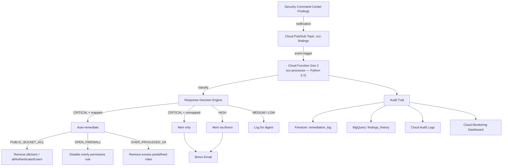
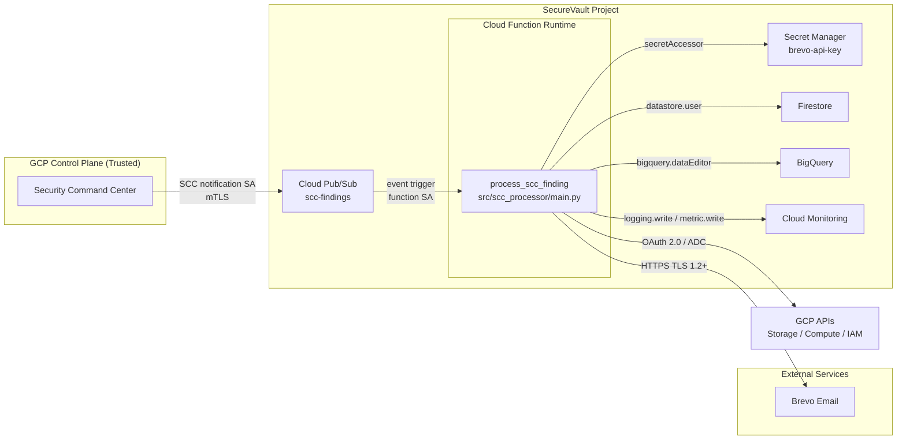

# SecureVault

> **Architected by Lanre Oluokun | Implementation: AI-assisted**

[](https://github.com/Bigbadlonewolf/SecureVault/actions/workflows/ci.yml)
[](LICENSE)

A cloud-native security detection and response pipeline on Google Cloud Platform (GCP). SecureVault consumes findings from Security Command Center (SCC), classifies them by severity, and responds with graded actions: **auto-remediate** critical issues, **alert** on high-severity findings, and **log** everything for audit.

> **What this is:** A runtime, detective/reactive security operations pipeline.  
> **What this is not:** A static compliance validation tool, a SIEM, or a production SOAR platform.

---

## Why SecureVault?

Financial institutions often operate dozens or hundreds of GCP projects. Security Command Center generates a high volume of findings, and low-hanging fruit — public buckets, open firewall rules, over-privileged service accounts — are frequently ignored until audit time. SecureVault automates response to the most severe misconfigurations, alerts on high-priority issues, and maintains a durable audit trail for post-incident review and trend analysis.

---

## Architecture

### Component View



### Data-Flow View



---

## Technology Stack

| Component | Choice | Justification |
|---|---|---|
| Findings source | Security Command Center | Native GCP integration; no extra licensing; data stays in GCP. |
| Ingestion | Cloud Pub/Sub | Event-driven, near-real-time, durable, decoupled; avoids SCC API polling quotas. |
| Compute | Cloud Functions Gen 2 | Simplest operational model for a single-purpose event handler; built-in scaling; generous free tier. |
| Language | Python 3.11 | Fastest path to a working pipeline; implementation speed outweighs runtime performance at this scale. |
| Alerting | Brevo free tier | Zero cost, 300 emails/day, SMTP + API support; graceful degradation to Cloud Logging. |
| Operational state | Firestore | Fast lookups, schema flexibility, generous free tier for low-volume audit logs. |
| Analytics | BigQuery | SQL analytics, date partitioning, cost-effective at scale; free tier covers early usage. |
| IaC | Terraform | All resources defined as code; reproducible deployments; plan/apply gates in CI. |
| CI/CD | GitHub Actions | Unified workflow for tests, security scans, and Terraform plan/validate. |

---

## Compliance Mapping

SecureVault is designed with controls mapped to common financial-services frameworks. The full mapping and assessor evidence locations are in [`context/COMPLIANCE_MAPPING.md`](context/COMPLIANCE_MAPPING.md).

| Framework | Controls Mapped | Evidence |
|---|---|---|
| **NIST SP 800-53 Rev 5** | SI-4, IR-4, AU-6, CM-6 | [`terraform/main.tf`](terraform/main.tf), [`src/scc_processor/processors/`](src/scc_processor/processors/), Cloud Monitoring Dashboard |
| **PCI DSS v4.0** | Req. 10 (Logging), Req. 11 (Vulnerability/Misconfiguration Management) | [`SECURITY.md`](SECURITY.md), [`src/scc_processor/storage/`](src/scc_processor/storage/), [`terraform/bigquery_schema.json`](terraform/bigquery_schema.json), Cloud Audit Logs |
| **SOC 2 (2017 TSC)** | CC6.1, CC7.2 | [`terraform/main.tf`](terraform/main.tf) (IAM, service account, Secret Manager), [`context/THREAT_MODEL.md`](context/THREAT_MODEL.md) |

---

## Threat Model Summary

The full threat model is in [`context/THREAT_MODEL.md`](context/THREAT_MODEL.md). The residual risk picture after controls is:

| Scenario | Inherent Risk | Residual Risk | Primary Control |
|---|---|---|---|
| Poisoned / spoofed finding injection | High | Low | Pub/Sub publisher restricted to SCC notification SA; unmapped CRITICAL findings alert only |
| Privilege escalation via auto-remediation | Critical | Low | Dedicated service account + custom least-privilege role; no destructive create/bind permissions |
| Alert suppression / notification failure | Medium | Low | Cloud Monitoring error-rate alert; graceful Brevo degradation; independent logging |
| Supply-chain compromise | Medium | Low–Medium | Pinned dependencies; `bandit`, `pip-audit`, `Checkov`, `truffleHog`; `CODEOWNERS` |
| Secret exfiltration from Secret Manager | High | Low | Single-secret access; no secrets in code or state; Cloud Audit Logs |

---

## Cost Breakdown

Target monthly cost is **under $5**, with a hard ceiling of **$20/month** and a billing alert at **$15/month**.

| Component | ~100 findings/mo | ~1,000 findings/mo | ~10,000 findings/mo |
|---|---:|---:|---:|
| Cloud Functions Gen 2 (256 MB) | $0 | $0 | $0 |
| Pub/Sub | $0 | $0 | $0 |
| Firestore | $0 | $0 | ~$0.00–$0.10 |
| BigQuery streaming + storage | $0 | $0 | <$0.05 |
| Secret Manager | $0 | $0 | $0 |
| Cloud Monitoring | $0 | $0 | $0 |
| Brevo | $0 | $0 | $0 |
| Cloud Storage (source zip) | <$0.01 | <$0.01 | <$0.01 |
| **Monthly total** | **~$0.01** | **~$0.05–$0.25** | **~$0.50–$1.50** |

At 10,000 findings/month with an average execution time of **2 seconds**, the workload still sits within the Cloud Functions Gen 2 free tier, so compute cost remains **$0**. A detailed, GB-second–verified model with sensitivity analysis is in [`context/COST_ANALYSIS.md`](context/COST_ANALYSIS.md).

---

## Quick Start

1. **Prerequisites**
   - GCP project with billing enabled
   - `gcloud` CLI authenticated
   - `terraform` >= 1.5 installed
   - Brevo account and API key

2. **Configure**
   ```bash
   cd terraform
   cp terraform.tfvars.example terraform.tfvars
   # Edit terraform.tfvars with your project_id, region, alert_email, etc.
   ```

3. **Store the Brevo API key in Secret Manager**
   ```bash
   echo -n "YOUR_BREVO_API_KEY" | gcloud secrets versions add brevo-api-key --data-file=-
   ```

4. **Deploy**
   ```bash
   terraform init
   terraform plan
   terraform apply
   ```

5. **Verify**
   ```bash
   make simulate-finding
   ```
   Then check Cloud Function logs and the `remediation_log` Firestore collection.

See [`docs/DEPLOYMENT_GUIDE.md`](docs/DEPLOYMENT_GUIDE.md) for a fresh-GCP-project walkthrough.

---

## Security & Honest Risk Assessment

- **No secrets are stored in source code.** Sensitive values live in Secret Manager.
- **Least-privilege IAM.** The Cloud Function runs under a dedicated service account with a custom remediation role.
- **Publisher-restricted Pub/Sub topic.** Only the SCC notification service account can publish to `scc-findings`.
- **All source passes** `bandit`, `pip-audit`, `Checkov`, and `truffleHog` scans in CI.

### Known Risks in v0.1.0

This is a portfolio-grade, single-region pipeline. It has **not** been deployed to a production financial environment or load-tested against real SCC volume.

- **Auto-remediation can cause outages.** Only three finding classes are auto-remediated, and every action is logged, but a misconfigured response matrix or a poisoned finding could still remove legitimate access. Start in alert-only mode if you are risk-averse.
- **Brevo free tier has no SLA.** If alerting fails, the function continues processing and logs the failure, but there is no automatic fallback channel yet.
- **Single-region deployment** means there is no automatic disaster recovery.
- **No SOAR integration.** Ticketing, analyst queues, and escalation playbooks are manual or Phase 2.

See [`SECURITY.md`](SECURITY.md) and [`context/THREAT_MODEL.md`](context/THREAT_MODEL.md) for full details.

---

## Architecture Decision Records

| ADR | Decision |
|---|---|
| [ADR-001](adr/ADR-001-scc-over-cspm.md) | Why SCC over third-party CSPM (Prisma Cloud, Wiz) |
| [ADR-002](adr/ADR-002-event-driven-architecture.md) | Why event-driven (Pub/Sub) over polling SCC API |
| [ADR-003](adr/ADR-003-cloud-functions-gen2.md) | Why Cloud Functions Gen 2 over Cloud Run over GKE |
| [ADR-004](adr/ADR-004-severity-response-matrix.md) | Severity classification and response matrix design |
| [ADR-005](adr/ADR-005-bigquery-plus-firestore.md) | Why BigQuery + Firestore over a single database |
| [ADR-006](adr/ADR-006-brevo-free-tier-alerting.md) | Why Brevo free tier over PagerDuty/SNS/Slack |
| [ADR-007](adr/ADR-007-threat-model-and-trust-boundaries.md) | Threat model and trust boundaries |
| [ADR-008](adr/ADR-008-cost-strategy-under-20-usd.md) | Cost strategy for continuous operation under $20/month |

---

## Documentation

| Document | Purpose |
|---|---|
| [`docs/DEPLOYMENT_GUIDE.md`](docs/DEPLOYMENT_GUIDE.md) | Step-by-step deployment for a fresh GCP project |
| [`docs/OPERATIONS_RUNBOOK.md`](docs/OPERATIONS_RUNBOOK.md) | 2 a.m. incident response procedures |
| [`docs/TESTING.md`](docs/TESTING.md) | Local and GCP testing instructions |
| [`docs/INTERVIEW_WALKTHROUGH.md`](docs/INTERVIEW_WALKTHROUGH.md) | 15-minute narrative for panel defense |
| [`context/THREAT_MODEL.md`](context/THREAT_MODEL.md) | Threat actors, trust boundaries, attack scenarios |
| [`context/COMPLIANCE_MAPPING.md`](context/COMPLIANCE_MAPPING.md) | NIST, PCI DSS, and SOC 2 mappings |
| [`context/COST_ANALYSIS.md`](context/COST_ANALYSIS.md) | GB-second–verified cost model and sensitivity analysis |
| [`EVOLUTION.md`](EVOLUTION.md) | Version history and Phase 2 roadmap |
| [`CONTRIBUTION.md`](CONTRIBUTION.md) | How to contribute, test, and report issues |
| [`adr/`](adr/) | Architecture Decision Records |

---

## Development

Use the provided `Makefile` or [`taskfile.yml`](taskfile.yml) (via [Task](https://taskfile.dev)):

```bash
# Run tests
make test            # or: task test

# Run security scans
make security        # or: task security

# Validate Terraform
make terraform-plan  # or: task terraform-plan

# Simulate a finding locally or against GCP
make simulate-finding  # or: task simulate-finding PROJECT_ID=your-project
```

---

## Known Limitations & Phase 2

- Single-region deployment (no multi-region DR) → Phase 2: multi-region backup function.
- Brevo free tier has no SLA → Phase 2: add PagerDuty/SNS fallback channel.
- Auto-remediation scoped to 3 finding classes → Phase 2: expand to public SQL, open Cloud SQL, etc.
- No SOAR integration → Phase 2: ServiceNow/Jira webhook connector.
- No analyst workflow tiering → Phase 2: L1/L2/L3 queue routing.
- No correlation across multiple signal sources → Phase 2: ingest Cloud Armor, VPC Flow Logs.
- Tested with simulated findings, not production-scale volume → Phase 2: load test with SCC export replay.

See [`EVOLUTION.md`](EVOLUTION.md) for the full roadmap.

---

## License

MIT — see [`LICENSE`](LICENSE).
