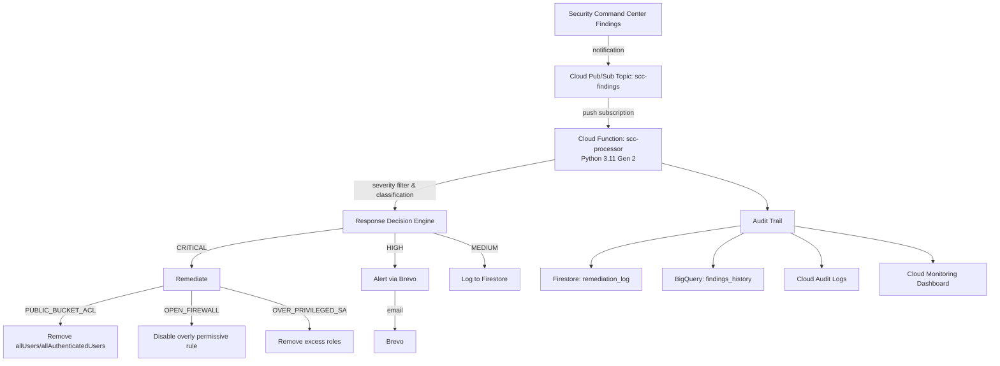

# SecureVault

> **Architected by Lanre Oluokun | Implementation: AI-assisted**

[](https://github.com/Bigbadlonewolf/SecureVault/actions/workflows/security-scan.yml)
[](https://github.com/Bigbadlonewolf/SecureVault/actions/workflows/terraform-plan.yml)

A cloud-native security detection and response pipeline on Google Cloud Platform (GCP). SecureVault consumes findings from Security Command Center (SCC), classifies them by severity, and responds with graded actions: auto-remediate critical issues, alert on high-severity findings, and log everything for audit.

> **What this is:** A runtime, detective/reactive security operations pipeline.  
> **What this is not:** A static compliance validation tool.

## Why SecureVault?

Financial institutions often operate dozens or hundreds of GCP projects. Security Command Center generates a high volume of findings, and low-hanging fruit such as public buckets, open firewall rules, and over-privileged service accounts are frequently ignored until audit time. SecureVault automates the response to the most severe findings, alerts on high-priority issues, and maintains a durable audit trail for post-incident review and trend analysis.

## Architecture



## Technology Stack

| Component | Choice | Justification |
|---|---|---|
| Findings source | Security Command Center | Native GCP integration; no extra licensing; data stays in GCP. |
| Ingestion | Cloud Pub/Sub | Event-driven, near-real-time, durable, decoupled; avoids SCC API polling quotas. |
| Compute | Cloud Functions Gen 2 | Simplest operational model for a single-purpose event handler; built-in scaling; lowest cost. |
| Language | Python 3.11 | Fastest path to a working pipeline; implementation speed outweighs runtime performance at this scale. |
| Alerting | Brevo free tier | Zero cost, 300 emails/day, SMTP + API support; graceful degradation to Cloud Logging. |
| Operational state | Firestore | Fast lookups, schema flexibility, generous free tier for low-volume audit logs. |
| Analytics | BigQuery | SQL analytics, date partitioning, cost-effective at scale; free tier covers early usage. |
| IaC | Terraform | All resources defined as code; reproducible deployments; plan/apply gates in CI. |
| CI/CD | GitHub Actions | Security scanning, Terraform plan on PRs, manual deployment workflow. |

## Cost Breakdown

Target monthly cost is **under $5**, with a hard ceiling of **$20/month**.

| Component | Current scale (~100 findings/month) | 10x scale (~1,000 findings/month) |
|---|---|---|
| Cloud Functions Gen 2 (256 MB) | $0 (within 2M free invocations) | $0 |
| Pub/Sub | $0 (within 10 GiB free tier) | $0 |
| Firestore | $0 (within 1M reads/writes free tier) | ~$0.10 |
| BigQuery | $0 (within 10 GiB storage + 1 TiB query free tier) | $0 |
| Secret Manager | $0 (1 active version within 6 free versions) | $0 |
| Cloud Monitoring | $0 (dashboard + alert policy free) | $0 |
| Brevo | $0 (free tier: 300 emails/day) | $0 |
| Cloud Storage (source zip) | <$0.01 | <$0.01 |
| **Monthly total** | **~$0.01–$0.50** | **~$0.50–$1.50** |

A detailed cost model with 100x scale estimates and optimization measures is in [`context/COST_ANALYSIS.md`](context/COST_ANALYSIS.md).

## Quick Start

1. **Prerequisites**
   - GCP project with billing enabled
   - `gcloud` CLI authenticated
   - `terraform` >= 1.5 installed
   - Brevo account and API key

2. **Configure**
   ```bash
   cd terraform
   cp terraform.tfvars.example terraform.tfvars
   # Edit terraform.tfvars with your project_id, region, alert_email, etc.
   ```

3. **Store the Brevo API key in Secret Manager**
   ```bash
   echo -n "YOUR_BREVO_API_KEY" | gcloud secrets versions add brevo-api-key --data-file=-
   ```

4. **Deploy**
   ```bash
   terraform init
   terraform plan
   terraform apply
   ```

5. **Verify**
   Publish a test SCC finding to the `scc-findings` topic and confirm the Cloud Function logs the action.

See [`docs/DEPLOYMENT_GUIDE.md`](docs/DEPLOYMENT_GUIDE.md) for a fresh-GCP-project walkthrough.

## Compliance Frameworks

SecureVault is designed with controls mapped to:

- **NIST SP 800-53 Rev 5**: SI-4, IR-4, AU-6, CM-6
- **PCI DSS v4.0**: Requirements 10 and 11
- **SOC 2**: CC6.1, CC7.2

Full mapping is in [`context/COMPLIANCE_MAPPING.md`](context/COMPLIANCE_MAPPING.md).

## Architecture Decision Records

| ADR | Decision |
|---|---|
| [ADR-001](adr/ADR-001-scc-over-cspm.md) | Why SCC over third-party CSPM (Prisma Cloud, Wiz) |
| [ADR-002](adr/ADR-002-event-driven-architecture.md) | Why event-driven (Pub/Sub) over polling SCC API |
| [ADR-003](adr/ADR-003-cloud-functions-gen2.md) | Why Cloud Functions Gen 2 over Cloud Run over GKE |
| [ADR-004](adr/ADR-004-severity-response-matrix.md) | Severity classification and response matrix design |
| [ADR-005](adr/ADR-005-bigquery-plus-firestore.md) | Why BigQuery + Firestore over a single database |
| [ADR-006](adr/ADR-006-brevo-free-tier-alerting.md) | Why Brevo free tier over PagerDuty/SNS/Slack |
| [ADR-007](adr/ADR-007-threat-model-and-trust-boundaries.md) | Threat model and trust boundaries |
| [ADR-008](adr/ADR-008-cost-strategy-under-20-usd.md) | Cost strategy for continuous operation under $20/month |

## Security

- No secrets are stored in source code. Sensitive values live in Secret Manager.
- Cloud Function uses a dedicated service account with least-privilege IAM.
- Pub/Sub topic is restricted so only SCC can publish.
- All source passes `bandit`, `pip-audit`, `Checkov`, and `truffleHog` scans.

See [`SECURITY.md`](SECURITY.md) and [`context/THREAT_MODEL.md`](context/THREAT_MODEL.md) for details.

## Documentation

| Document | Purpose |
|---|---|
| [`docs/DEPLOYMENT_GUIDE.md`](docs/DEPLOYMENT_GUIDE.md) | Step-by-step deployment for a fresh GCP project |
| [`docs/OPERATIONS_RUNBOOK.md`](docs/OPERATIONS_RUNBOOK.md) | 2 a.m. incident response procedures |
| [`docs/TESTING.md`](docs/TESTING.md) | Local and GCP testing instructions |
| [`docs/INTERVIEW_WALKTHROUGH.md`](docs/INTERVIEW_WALKTHROUGH.md) | 15-minute narrative for panel defense |
| [`context/THREAT_MODEL.md`](context/THREAT_MODEL.md) | Threat actors, trust boundaries, attack scenarios |
| [`context/COMPLIANCE_MAPPING.md`](context/COMPLIANCE_MAPPING.md) | NIST 800-53 and PCI DSS mappings |
| [`context/COST_ANALYSIS.md`](context/COST_ANALYSIS.md) | Cost breakdown and scaling estimates |
| [`adr/`](adr/) | Architecture Decision Records |

## Known Limitations & Phase 2

- Single-region deployment (no multi-region DR) → Phase 2: multi-region backup function.
- Brevo free tier has no SLA → Phase 2: add PagerDuty/SNS fallback channel.
- Auto-remediation scoped to 3 finding classes → Phase 2: expand to public SQL, open Cloud SQL, etc.
- No SOAR integration → Phase 2: ServiceNow/Jira webhook connector.
- No analyst workflow tiering → Phase 2: L1/L2/L3 queue routing.
- No correlation across multiple signal sources → Phase 2: ingest Cloud Armor, VPC Flow Logs.
- Tested with simulated findings, not production-scale volume → Phase 2: load test with SCC export replay.

## License

MIT — see [`LICENSE`](LICENSE).
