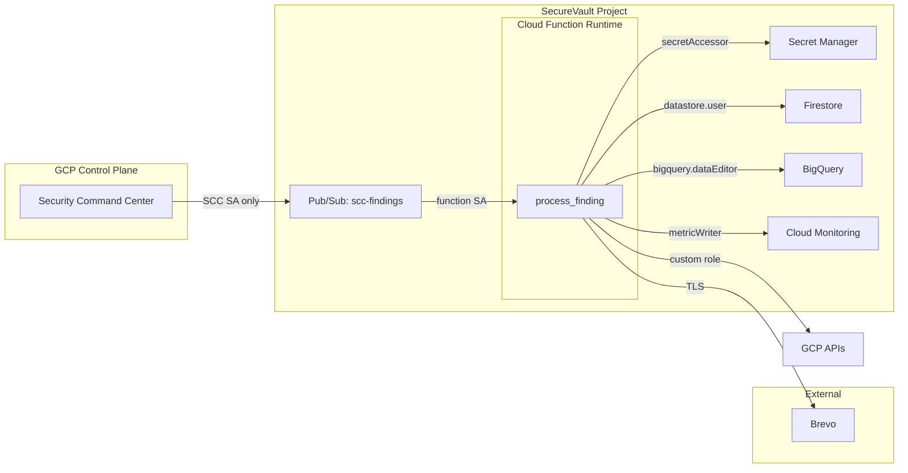

# ADR-007: Threat Model and Trust Boundaries

- **Decision Owner:** Lanre Oluokun
- **Date:** 2026-07-03
- **Status:** Accepted
- **Implementation:** AI-assisted under architect direction

## Context

A detection and response pipeline is an attractive target: if an attacker can influence what the pipeline sees or how it acts, they can hide evidence or amplify damage. The architecture must therefore define clear trust boundaries, enforce least privilege at each boundary, and limit blast radius if any single identity is compromised.

## Decision

Adopt the following trust-boundary design:

1. **SCC control plane → Pub/Sub:** Only the SCC notification service account may publish to `scc-findings`.
2. **Pub/Sub → Cloud Function:** The function runs under a dedicated service account (`scc-processor`) with no project-level Editor/Owner roles.
3. **Function → GCP APIs:** The function uses a custom IAM role (`securevault.remediator`) scoped to remediation-adjacent permissions. Only two are currently exercised (`PUBLIC_BUCKET_ACL`, `OPEN_FIREWALL`); permissions for a third, excluded handler remain provisioned as documented technical debt (see ADR-004, `context/THREAT_MODEL.md`).
4. **Function → secrets:** The function may access only the single Secret Manager secret for the Brevo API key.
5. **Function → alerting:** External alerting uses HTTPS to Brevo; failures are logged locally.

## Consequences

**Positive:**

- Compromise of the function service account cannot grant project ownership.
- A poisoned finding cannot trigger destructive actions outside the mapped classes.
- Cloud Audit Logs provide tamper-evident evidence of every IAM and API call.

**Negative:**

- More IAM policies to manage and review.
- Adding new remediation classes requires updating the custom role.

## Threat Model Diagram

## Alternatives Considered

| Alternative | Pros | Cons | Verdict |
|---|---|---|---|
| Default compute service account | Simpler IAM setup | Overly broad permissions; classic escalation path | Rejected. |
| Project Editor role for function | Easy to get started | Violates least privilege; compromise = full project access | Rejected. |
| No Pub/Sub IAM restriction | Easier to test | Any publisher can inject findings | Rejected. |
| Secrets in environment variables | Simpler code | Exposes secrets in logs and process listings | Rejected. |

## References

- [Cloud IAM best practices](https://cloud.google.com/iam/docs/using-iam-securely)
- [Secret Manager best practices](https://cloud.google.com/secret-manager/docs/best-practices)
- SecureVault [`context/THREAT_MODEL.md`](../context/THREAT_MODEL.md)
