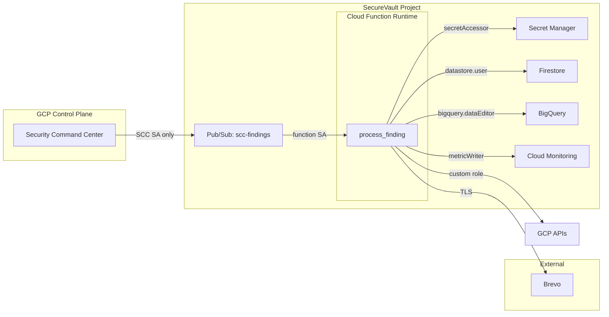

# ADR-007: Threat model and trust boundaries

- **Decision Owner:** Lanre Oluokun
- **Date:** 2026-07-03
- **Status:** Accepted
- **Implementation:** AI-assisted under architect direction

## Context

A detection and response pipeline is an attractive target: if an attacker can influence what the pipeline sees or how it acts, they can hide evidence or amplify damage. The architecture must therefore define clear trust boundaries, enforce least privilege at each boundary, and limit blast radius if any single identity is compromised.

## Decision

Adopt the following trust-boundary design:

1. **SCC control plane → Pub/Sub:** The design restricts publishing to the SCC notification service account. **This is not deployed.** That service agent exists only once an SCC notification config is created, which requires Security Command Center Premium; on a Standard-tier project the binding fails at apply and was removed from `terraform/` on 2026-08-17. The topic has no explicit publisher binding today, so the alternative this ADR rejected below ("No Pub/Sub IAM restriction") is in effect the deployed state. Restore both together if Premium is enabled.
2. **Pub/Sub → Cloud Function:** The function runs under a dedicated service account (`scc-processor`) with no project-level Editor/Owner roles.
3. **Function → GCP APIs:** The function uses a custom IAM role (`securevault.remediator`) scoped to remediation-adjacent permissions. The two exercised handlers (`PUBLIC_BUCKET_ACL`, `OPEN_FIREWALL`) account for every write permission in the role. The `setIamPolicy` permissions once provisioned for the excluded third handler were revoked once that handler was deleted, closing the technical debt this ADR previously recorded (see ADR-004, `context/THREAT_MODEL.md`).
4. **Function → secrets:** The function may access only the single Secret Manager secret for the Brevo API key.
5. **Function → alerting:** External alerting uses HTTPS to Brevo; failures are logged locally.

## Consequences

**Positive:**

- Compromise of the function service account cannot grant project ownership.
- A poisoned finding cannot trigger destructive actions outside the mapped classes.
- Cloud Audit Logs provide tamper-evident evidence of IAM changes and of data access to Secret Manager, KMS, and Storage. Admin Activity logging is always on; data-access logging is **not** on by default and was enabled explicitly via `google_project_iam_audit_config` on 2026-08-17. Scoped to those three services, so this is not evidence of "every API call" — an earlier version of this ADR claimed that and was wrong.

**Negative:**

- More IAM policies to manage and review.
- Adding new remediation classes requires updating the custom role.

## Threat model diagram

```mermaid
flowchart LR
    subgraph GCP_Control["GCP Control Plane"]
        SCC[Security Command Center]
    end

    subgraph SecureVault["SecureVault Project"]
        PS[Pub/Sub: scc-findings]
        subgraph Function_Runtime["Cloud Function Runtime"]
            FN[process_finding]
        end
        SM[Secret Manager]
        FS[Firestore]
        BQ[BigQuery]
        MON[Cloud Monitoring]
    end

    subgraph External["External"]
        BV[Brevo]
    end

    SCC -->|SCC SA only| PS
    PS -->|function SA| FN
    FN -->|custom role| API[GCP APIs]
    FN -->|secretAccessor| SM
    FN -->|datastore.user| FS
    FN -->|bigquery.dataEditor| BQ
    FN -->|TLS| BV
    FN -->|metricWriter| MON
```

## Alternatives considered

| Alternative | Pros | Cons | Verdict |
|---|---|---|---|
| Default compute service account | Simpler IAM setup | Overly broad permissions; classic escalation path | Rejected. |
| Project Editor role for function | Easy to get started | Violates least privilege; compromise = full project access | Rejected. |
| No Pub/Sub IAM restriction | Easier to test | Any publisher can inject findings | Rejected. |
| Secrets in environment variables | Simpler code | Exposes secrets in logs and process listings | Rejected. |

## References

- [Cloud IAM best practices](https://cloud.google.com/iam/docs/using-iam-securely)
- [Secret Manager best practices](https://cloud.google.com/secret-manager/docs/best-practices)
- SecureVault [`context/THREAT_MODEL.md`](../context/THREAT_MODEL.md)
