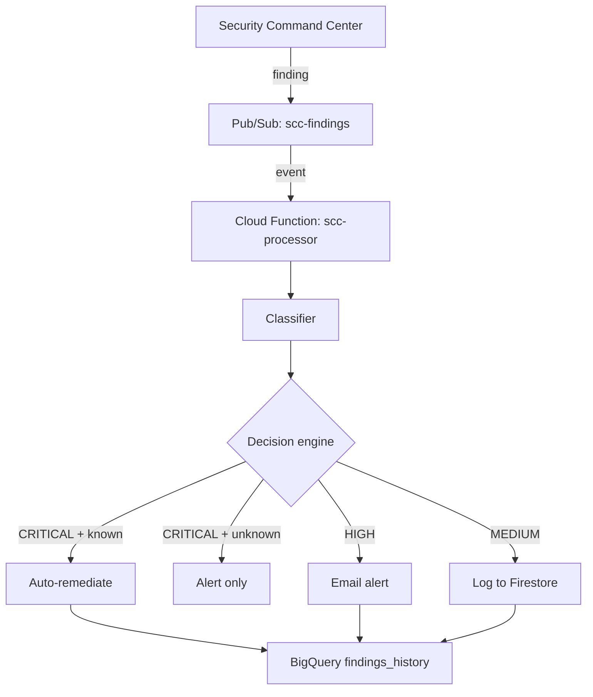

In my work with banks and other financial companies, I keep seeing the same problem. Google Cloud’s Security Command Center flags misconfigurations every day, but the alerts pile up unread. By the time an auditor asks about them, the issues have been sitting there for weeks. Public storage buckets, firewall rules open to the internet, and over-privileged service accounts are the kind of findings that should be fixed immediately, yet they often wait for a manual review that never comes.

I built SecureVault to fix that. It is a small, event-driven pipeline that reads SCC findings, decides how serious each one is, and acts automatically when the risk is clear. This post explains what it does, why I built it this way, and how I used an AI coding assistant to speed up implementation while keeping every design decision under my control.

## The Problem

Large GCP environments generate a constant stream of security findings. That sounds good, but volume becomes the enemy. When a team sees hundreds of low- and medium-severity items, they tend to ignore the whole list. Critical items get lost in the noise.

The real gap is not detection. SCC already detects the problems. The gap is response: turning a finding into action quickly, with a record of what happened. Enterprise Cloud Security Posture Management tools can do this, but they come with enterprise price tags and often require sending data outside GCP. I wanted something native to GCP, cheap enough to leave running forever, and fast enough to close simple issues before an attacker finds them.

## What SecureVault Does

SecureVault consumes SCC findings from a Pub/Sub topic, classifies each one, and takes one of three actions:

- **Critical findings in a known class** are fixed automatically and an alert is sent.
- **High-severity findings** are escalated to a human by email.
- **Medium-severity findings** are logged for trend analysis.

The known classes that get automatic remediation today are public Cloud Storage buckets, open VPC firewall rules, and over-privileged service accounts. These are high-impact, low-risk-to-fix problems. If SecureVault sees a critical finding it does not recognize, it alerts instead of acting, so automation never runs blind.

Every action is written to Firestore for fast operational lookups and to BigQuery for long-term analysis. Cloud Audit Logs already capture IAM changes, so there is a third layer of evidence built into GCP itself.

## Architecture Choices

I kept the stack small on purpose. Each service was chosen to solve one problem well and to stay within GCP’s free tier at low volume.

**Security Command Center** is the findings source because it is native. There is no extra license, no outbound data, and the notification path is stable.

**Cloud Pub/Sub** sits between SCC and the processor. It decouples the two, so if the function is redeploying or crashing, messages wait in the topic instead of being lost. I set retention to one day because longer retention costs money and these messages do not need to sit around.

**Cloud Functions Gen 2** runs the processor. For a single event handler, Gen 2 is the simplest option. It scales automatically, has a built-in Pub/Sub trigger, and the free tier covers two million invocations per month. Cloud Run or GKE would add operational work I did not need.

**Firestore** stores the remediation log. It is fast, schema-flexible, and its free tier is generous for a low-volume audit trail.

**BigQuery** stores historical findings in a date-partitioned table. Partitioning keeps trend queries cheap because each query scans only the days it needs.

**Brevo** sends email alerts. The free tier covers three hundred emails per day, which is far more than this pipeline is expected to send. If Brevo is down, the function logs the failure and continues, so alerting does not take down the whole pipeline.

**Terraform** defines every resource. That makes the environment reproducible and lets CI run `terraform plan` on every pull request.

## Why These Decisions Matter

I wrote an Architecture Decision Record for each major choice. Four of them are worth highlighting here.

**SCC over a third-party CSPM.** The environment is already in GCP, so using SCC avoids per-workload licensing and keeps data inside the project. Tools like Wiz and Prisma Cloud have richer dashboards, but for this scope the native integration won on cost and data residency.

**Event-driven over polling.** Polling the SCC API would add latency, consume quota, and risk missing findings between intervals. Pub/Sub pushes findings as they appear and buffers them if the processor is busy.

**Cloud Functions Gen 2 over Cloud Run or GKE.** The processor does one thing: handle Pub/Sub events. Gen 2 gives automatic scaling, a built-in trigger, and a generous free tier. A container platform would add operational work without adding value for this single handler.

**Severity response matrix.** Automation is powerful, but only when it is safe. I chose to auto-remediate three well-understood finding classes. Anything else, even if critical, is alerted to a human first. This prevents the pipeline from making changes it cannot reason about.

## The AI-Assisted Build

I designed every part of SecureVault: the service selection, the threat model, the response matrix, the IAM model, the compliance mapping, and the cost ceiling. Once the design was clear, I used an AI coding assistant as an implementation engineer. It wrote the Terraform, Python, tests, and documentation, then ran security scanners and fixed the issues it found.

That split worked well. The AI moved fast on boilerplate, which let me focus on the parts that matter: least-privilege permissions, what happens when a finding is poisoned, and how to keep monthly cost under five dollars. Every source file carries an attribution header that reads **“Architect: Lanre Oluokun | Implementation: AI-assisted.”** The design is mine; the keystrokes were accelerated.

## Cost Engineering

The target is under five dollars per month, with a hard ceiling of twenty dollars and a billing alert at fifteen.

At roughly one hundred findings per month, the projected cost is a few cents. At ten times that volume, it is still under a dollar. The main optimizations are:

- 256 MB of function memory.
- One-day Pub/Sub retention.
- Date-partitioned BigQuery table.
- Free-tier alerting through Brevo.

These are not accidental. Each one came from asking whether the cheapest reasonable option still met the requirement.

To put the numbers in perspective, a Cloud Functions invocation at 256 MB costs a fraction of a cent. Pub/Sub’s first ten gigabytes per month are free. Firestore gives one million reads and one million writes per month before charging. BigQuery gives ten gigabytes of storage and one terabyte of query processing. At the expected volume, none of those limits are reached, so the monthly bill is essentially the Cloud Storage cost of a sub-megabyte source zip.

If volume grows by a hundred times, the architecture still stays under the twenty-dollar ceiling. The first change at that scale would be to add BigQuery slot reservations or query optimization, but the design is built to absorb growth without re-architecting.

## Security-First Development

Because SecureVault is itself a security control, its own compromise would be serious. I addressed that with tight trust boundaries and least-privilege IAM.

The Pub/Sub topic only allows the SCC notification service account to publish. The Cloud Function runs under a dedicated service account with a custom role that only permits the three supported remediation actions. There is no project Editor or Owner binding. The Brevo API key lives in Secret Manager, never in code or environment variables.

The CI pipeline runs Bandit, pip-audit, Checkov, and truffleHog on every push. The goal is a clean baseline. Checkov flags six optional data-protection controls that I intentionally skip because they would push the cost above the five-dollar target without adding proportional value. Each skip is documented in the code and in the security scan report.

> **Update (2026-07-03):** Fixed a TruffleHog configuration bug in the CI pipeline. The secret scanner was failing on every `push` to `main` because `base` and `head` both pointed to the same commit. The fix uses conditional expressions so TruffleHog scans the full history on push and the diff on pull requests.

I also threat-modeled the pipeline itself. The three worst cases were a poisoned finding, privilege escalation through remediation, and alert suppression. Each is addressed: the topic restricts publishers, the function has a narrow custom role, and Cloud Monitoring alerts fire if the function error rate spikes.

## What I Learned

The biggest lesson was how much faster I could move when I separated architecture from implementation. Letting the AI handle repetitive code and scanner loops freed me to focus on threat modeling and the response matrix.

Cost constraints also turned out to be useful. The twenty-dollar ceiling forced native services, free tiers, and short retention. Those constraints produced a cleaner design than if I had started with a larger budget.

Documentation is part of the product. ADRs, a threat model, and a compliance mapping are not overhead; they are the proof that the design was intentional.

## Known Limitations and What Comes Next

SecureVault is deliberately scoped for a first release. Its current limitations are:

- Single-region deployment, with no multi-region disaster recovery yet.
- Brevo’s free tier has no SLA, so alerting is not guaranteed.
- Auto-remediation is limited to three finding classes.
- No SOAR integration with tools like ServiceNow or Jira.
- No L1/L2/L3 analyst routing.
- Only SCC is ingested; other signal sources are not correlated.

The next phase includes multi-source ingestion from Cloud Armor and VPC Flow Logs, SOAR connectors, analyst tiering, expanded remediation handlers, and multi-region backup.

## Explore the Code

The full source, Terraform, tests, and documentation are on GitHub:

**[github.com/Bigbadlonewolf/SecureVault](https://github.com/Bigbadlonewolf/SecureVault)**

If you are building something similar, start with the architecture decision records and the threat model. The code is small by design; the thinking behind it is where the work lives.
