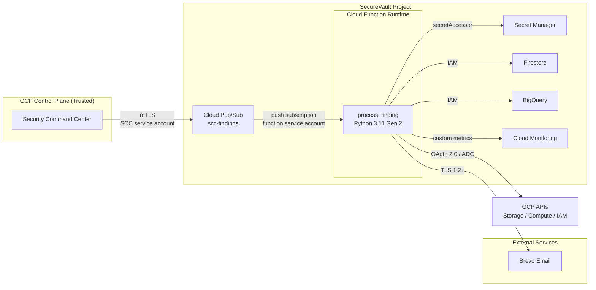

# SecureVault Threat Model

> **Author:** Lanre Oluokun  
> **Implementation:** AI-assisted under architect direction  
> **Date:** 2026-07-03  
> **Status:** Initial release (v0.1.0)

This document describes the threat model for SecureVault: the trust boundaries, threat actors, attack scenarios, mitigations, and residual risk ratings that shaped the architecture. It is a living document and should be reviewed whenever the response matrix, IAM model, or ingestion path changes.

## Data Flow & Trust Boundaries

SecureVault’s data flow moves from GCP’s native security service, through a Pub/Sub queue, into a Cloud Function, and then to downstream storage, remediation APIs, and alerting. Each transition is an explicit trust boundary where authentication and authorization are enforced.

### Trust Boundary Definitions

| Boundary | Components | Authentication | Blast Radius if Compromised |
|---|---|---|---|
| TB0 — SCC control plane | Security Command Center → Pub/Sub | SCC notification service account with `roles/pubsub.publisher` on `scc-findings` only | Attacker could inject poisoned findings or suppress real ones. |
| TB1 — Project perimeter | Pub/Sub → Cloud Function | Function service account with `roles/pubsub.subscriber` via event trigger | Attacker could read backlog or replay stale messages. |
| TB2 — Function runtime | Function code → downstream services | Dedicated service account `scc-processor@` with least-privilege IAM | Attacker could auto-remediate, exfiltrate secrets, or suppress alerts. |
| TB3 — External alerting | Function → Brevo | HTTPS + Secret Manager API key | Attacker could disable alerting or send phishing alerts. |

## Threat Actors

| Actor | Motivation | Typical Access |
|---|---|---|
| **Malicious Insider** | Hide misconfigurations, retaliate, or bypass controls before audit. | GCP project IAM, Terraform access, or admin console. |
| **External Attacker** | Exfiltrate data, move laterally, or disrupt security operations. | Compromised credentials, stolen service account keys, or supply-chain artifacts. |
| **Compromised Service Account** | Abuse pre-assigned permissions silently via API calls. | Stolen key for `scc-processor`, SCC notification SA, or deployment SA. |
| **Supply-Chain Adversary** | Insert malicious dependency, Terraform provider, or source code. | PyPI package, compromised GitHub Actions runner, or pinned-but-vulnerable library. |

## Attack Scenarios, Risk Ratings & Mitigations

### 1. Poisoned / Spoofed Finding Injection

**Description:** An attacker who gains the ability to publish to the `scc-findings` topic injects fake findings. A fake CRITICAL finding could trigger unwanted auto-remediation (for example, stripping IAM from a legitimate bucket), while fake MEDIUM findings could create alert fatigue and hide real issues.

| Attribute | Rating |
|---|---|
| Inherent risk | **High** |
| Residual risk (with mitigations) | **Low** |

**Mitigations:**

- The Pub/Sub topic grants `roles/pubsub.publisher` only to the SCC notification service account (`gcp-sa-scc-notification.iam.gserviceaccount.com`).
- The default compute service account is explicitly denied access to the topic.
- The response matrix limits auto-remediation to three well-understood finding classes; any unmapped CRITICAL finding is alerted on but **not** auto-remediated.
- All publish attempts are recorded in Cloud Audit Logs for anomaly detection.
- Finding schema validation in `processors/classifier.py` rejects malformed payloads.

### 2. Privilege Escalation via Auto-Remediation

**Description:** If the Cloud Function runtime or its service account is compromised, an attacker could abuse remediation permissions to remove legitimate access controls, disable firewall rules protecting sensitive systems, or modify IAM policies to grant themselves access.

| Attribute | Rating |
|---|---|
| Inherent risk | **Critical** |
| Residual risk (with mitigations) | **Low** |

**Mitigations:**

- The function runs under a dedicated service account, not the default compute account.
- A custom IAM role (`securevault.remediator`) grants only the minimum permissions needed for the three supported remediation handlers:
  - `storage.buckets.get`, `storage.buckets.setIamPolicy`
  - `compute.firewalls.get`, `compute.firewalls.update`
  - `iam.serviceAccounts.get`, `iam.serviceAccounts.setIamPolicy`
  - `resourcemanager.projects.getIamPolicy`, `resourcemanager.projects.setIamPolicy`
- No `roles/owner`, `roles/editor`, or broad `resourcemanager.*` permissions are assigned.
- The function does **not** create new bindings; it only removes `allUsers` / `allAuthenticatedUsers` from buckets, disables overly permissive firewall rules, and trims excess predefined roles from service accounts.
- Every remediation action is written to Firestore and BigQuery with a timestamp and outcome, producing an immutable audit trail.
- Unmapped CRITICAL findings trigger alerts but skip remediation (status `SKIPPED_UNMAPPED`).

### 3. Alert Suppression or Notification Failure

**Description:** An attacker or operational issue prevents alerts from reaching the security team. This could happen by disabling the Brevo API key, DDoSing the function, or causing repeated crashes that exhaust retries.

| Attribute | Rating |
|---|---|
| Inherent risk | **Medium** |
| Residual risk (with mitigations) | **Low** |

**Mitigations:**

- Brevo failures are caught in code; the function logs a critical error and continues processing rather than crashing.
- A Cloud Monitoring alert policy (`SecureVault Function Error Rate > 5%`) notifies the team if the function misbehaves.
- All processed findings are written to Cloud Logging, Firestore, and BigQuery independently of email delivery.
- Pub/Sub dead-letter and retry policies preserve messages that fail transiently.

### 4. Supply-Chain Compromise

**Description:** A malicious Python dependency, compromised Terraform provider, or tampered source archive introduces backdoors, secret exfiltration, or destructive behavior.

| Attribute | Rating |
|---|---|
| Inherent risk | **Medium** |
| Residual risk (with mitigations) | **Low–Medium** |

**Mitigations:**

- Python dependencies are pinned in `src/requirements.txt` and audited with `pip-audit` in CI.
- `bandit` scans source code for unsafe patterns on every push.
- `Checkov` and `tfsec` validate Terraform for misconfigurations.
- `truffleHog` and `gcloud secrets scan` detect accidental secret commits.
- Terraform state and source archives live in project-owned GCS buckets with uniform bucket-level access and public access prevention.
- GitHub `CODEOWNERS` requires review by `@Bigbadlonewolf`.

### 5. Secret Exfiltration from Secret Manager

**Description:** An attacker with access to the function runtime or its service account retrieves the Brevo API key or other secrets stored in Secret Manager.

| Attribute | Rating |
|---|---|
| Inherent risk | **High** |
| Residual risk (with mitigations) | **Low** |

**Mitigations:**

- Secrets are never stored in source code, environment variables, or Terraform state.
- The function service account holds only `roles/secretmanager.secretAccessor` for the single Brevo secret.
- Secret Manager access is logged in Cloud Audit Logs.
- The placeholder secret version created by Terraform is disabled and intended to be replaced via `gcloud` or the console.

## Risk Summary

| Scenario | Inherent Risk | Residual Risk | Primary Mitigation |
|---|---|---|---|
| Poisoned finding injection | High | Low | Publisher-restricted Pub/Sub topic + unmapped CRITICAL alert-only default |
| Privilege escalation via remediation | Critical | Low | Dedicated SA + custom least-privilege role + no destructive create/bind permissions |
| Alert suppression / notification failure | Medium | Low | Cloud Monitoring alert policy + logging fallback + graceful Brevo degradation |
| Supply-chain compromise | Medium | Low–Medium | Pinned dependencies + SAST/IaC scanning + CODEOWNERS |
| Secret exfiltration | High | Low | Secret Manager + minimal IAM + audit logging |

## References

- [Google Cloud Security Command Center — Finding notifications](https://cloud.google.com/security-command-center/docs/how-to-send-notifications)
- [Google Cloud Pub/Sub — IAM roles](https://cloud.google.com/pubsub/docs/access-control)
- [Google Cloud Functions — Runtime service accounts](https://cloud.google.com/functions/docs/concepts/iam-runtime)
- SecureVault [`adr/ADR-007-threat-model-and-trust-boundaries.md`](../adr/ADR-007-threat-model-and-trust-boundaries.md)
