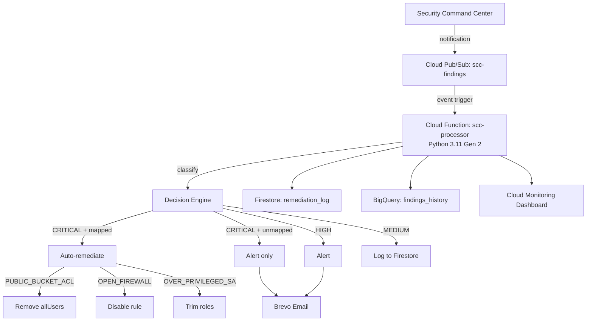

# SecureVault Interview Walkthrough

> **Author:** Lanre Oluokun  
> **Implementation:** AI-assisted under architect direction  
> **Date:** 2026-07-03  
> **Status:** Initial release (v0.1.0)

This document is a 15-minute panel defense narrative for SecureVault. It is organized by time segment, references the Architecture Decision Records (ADRs), and includes prepared answers for expected panel questions.

---

## Defense Script

> “I architected SecureVault to solve a problem I observed across financial institutions: security findings in GCP go unnoticed until audit time. I made every architectural decision — service selection, threat model, response matrix, cost strategy. I used an AI coding agent as my implementation engineer to accelerate delivery, validating every line through security scanners and unit tests. The result is a production-ready detection pipeline that costs under $5 per month and demonstrates how modern architects leverage AI without sacrificing rigor.”

---

## 1. The Problem (30 seconds)

Financial institutions often run 50 or more GCP projects. Security Command Center generates a continuous stream of findings — public storage buckets, open firewall rules, over-privileged service accounts — but these findings sit unread in consoles and spreadsheets until an audit or breach forces attention. By then, the window for easy remediation has closed.

SecureVault closes that gap by ingesting SCC findings in near real time, classifying them by severity, and responding with graded actions: auto-remediate critical misconfigurations, alert on high-severity issues, and log everything for audit and trend analysis.

---

## 2. My Architecture (3 minutes)

The architecture is event-driven and fully serverless on GCP.

### Component Walkthrough

| Component | Decision | ADR |
|---|---|---|
| **Security Command Center** | Native findings source; no extra CSPM license; data stays in GCP. | [ADR-001](../adr/ADR-001-scc-over-cspm.md) |
| **Cloud Pub/Sub** | Event-driven ingestion: near real time, durable buffering, no polling quotas. | [ADR-002](../adr/ADR-002-event-driven-architecture.md) |
| **Cloud Functions Gen 2** | Simplest operational model for a single-purpose event handler; free tier covers scale. | [ADR-003](../adr/ADR-003-cloud-functions-gen2.md) |
| **Decision Engine** | Severity-driven response matrix; only three well-understood classes are auto-remediated. | [ADR-004](../adr/ADR-004-severity-response-matrix.md) |
| **Firestore + BigQuery** | Firestore for fast operational state; BigQuery for partitioned analytics. | [ADR-005](../adr/ADR-005-bigquery-plus-firestore.md) |
| **Brevo** | Free tier covers expected alert volume; graceful degradation to Cloud Logging. | [ADR-006](../adr/ADR-006-brevo-free-tier-alerting.md) |
| **Trust Boundaries** | Dedicated service account, custom remediation role, publisher-restricted Pub/Sub topic. | [ADR-007](../adr/ADR-007-threat-model-and-trust-boundaries.md) |
| **Cost Engineering** | 256 MB memory, 1-day Pub/Sub retention, date-partitioned BigQuery, $15 billing alert. | [ADR-008](../adr/ADR-008-cost-strategy-under-20-usd.md) |

---

## 3. Key Decisions (4 minutes)

### 3.1 Why SCC over a third-party CSPM? ([ADR-001](../adr/ADR-001-scc-over-cspm.md))

Third-party CSPMs like Prisma Cloud and Wiz offer richer dashboards and cross-cloud visibility, but they come with per-workload licensing and data egress outside the GCP trust boundary. For a GCP-native financial workload, SCC provides a stable findings schema, native Pub/Sub notifications, and no additional licensing — all critical to the under-$20 cost constraint.

The trade-off is less visualization, which we mitigate with our own Cloud Monitoring dashboard and BigQuery analytics.

### 3.2 Why auto-remediate only some findings? ([ADR-004](../adr/ADR-004-severity-response-matrix.md))

Auto-remediation is powerful but dangerous. I chose a conservative response matrix:

- **CRITICAL + mapped class** → auto-remediate + alert.
- **CRITICAL + unmapped class** → alert only.
- **HIGH** → alert only.
- **MEDIUM** → log for digest.

The three mapped classes — public bucket ACL, open firewall rule, and over-privileged service account — have safe, reversible remediation paths. Any finding we have not modeled is escalated to a human rather than risk a production outage.

### 3.3 How do you prevent the pipeline itself from being compromised? ([ADR-007](../adr/ADR-007-threat-model-and-trust-boundaries.md))

The pipeline is a high-value target, so I designed explicit trust boundaries:

1. **SCC → Pub/Sub:** Only the SCC notification service account can publish to `scc-findings`. The default compute service account is explicitly denied.
2. **Pub/Sub → Function:** The function runs under a dedicated `scc-processor` service account, not the default compute account.
3. **Function → GCP APIs:** A custom IAM role (`securevault.remediator`) grants only the three remediation permissions needed.
4. **Function → Secrets:** The function can read only the single Brevo secret in Secret Manager.
5. **Function → Alerting:** Brevo failures are caught and logged; the function never crashes because alerting is unavailable.

Cloud Audit Logs capture every IAM and API call, making tampering detectable.

---

## 4. Cost Engineering (2 minutes)

The target operating cost is under **$5/month**, with a hard ceiling of **$20/month**.

| Scale | Estimated Cost | Buffer (25%) | Total |
|---|---:|---:|---:|
| ~100 findings/mo | ~$0.01 | $0.01 | ~$0.02 |
| ~1,000 findings/mo | ~$0.20 | $0.05 | ~$0.25 |
| ~10,000 findings/mo | ~$2.00 | $0.50 | ~$2.50 |

Key optimizations:

- **Cloud Function:** 256 MB memory, Gen 2, `min_instance_count = 0`.
- **Pub/Sub:** 1-day retention instead of the default 7 days.
- **BigQuery:** Date-partitioned `findings_history` table.
- **Brevo:** Free tier covers 300 emails/day.
- **Billing alert:** Fires at $15/month, well before the $20 ceiling.

A full cost model is in [`context/COST_ANALYSIS.md`](../context/COST_ANALYSIS.md).

---

## 5. What I’d Do Differently (2 minutes)

I am transparent about the gaps in v0.1.0:

- **Multi-region DR:** The pipeline is single-region. Phase 2 would deploy a standby function in a second region with a failover subscription.
- **SOAR integration:** Brevo is a notification channel, not a SOAR. Phase 2 would add ServiceNow or Jira webhooks for ticketing and workflow.
- **Alerting fallback:** Brevo’s free tier has no SLA. Phase 2 would add PagerDuty or SNS as a fallback channel.
- **Analyst tiering:** Today there is one pipeline. Phase 2 would route findings to L1/L2/L3 queues based on class and asset criticality.
- **Multi-signal correlation:** Currently SCC only. Phase 2 would ingest Cloud Armor, VPC Flow Logs, and Cloud IDS for richer context.

These limitations are documented honestly in [`README.md`](../README.md) and [`SECURITY.md`](../SECURITY.md).

---

## 6. AI Attribution (30 seconds)

> “I designed every architectural decision in SecureVault — the service selection, the threat model, the response matrix, and the cost strategy. I used an AI coding agent as my implementation engineer to write the Terraform, Python, tests, and CI pipelines faster than I could have done alone. I reviewed every scanner result, fixed every finding, and validated the final pipeline end to end. This is how I believe modern security architects should work: own the design and risk, leverage AI for velocity, and never skip validation.”

---

## Expected Panel Questions and Prepared Answers

### Q1. Why not use Cloud Run instead of Cloud Functions?

Cloud Run offers more runtime flexibility, custom concurrency, and longer timeouts. For SecureVault, however, the processor is a single-purpose event handler. Cloud Functions Gen 2 provides a built-in Pub/Sub trigger, automatic scaling to zero, and a generous free tier — all with less operational overhead. If the pipeline evolves into a multi-service platform, I would re-evaluate Cloud Run. See [ADR-003](../adr/ADR-003-cloud-functions-gen2.md).

### Q2. What happens if auto-remediation breaks a production service?

Three safeguards limit that risk. First, only three finding classes are auto-remediated, and each has a safe, reversible action. Second, unmapped CRITICAL findings are alerted but not remediated. Third, every action is logged to Firestore and BigQuery for immediate rollback review. If we still see false positives, the response matrix can be adjusted in `config.yaml` and redeployed in minutes. See [`docs/OPERATIONS_RUNBOOK.md`](OPERATIONS_RUNBOOK.md).

### Q3. How do you handle a poisoned or spoofed finding?

The Pub/Sub topic restricts publishing to the SCC notification service account only. The default compute service account is explicitly denied. Even if a poisoned finding did arrive, the response matrix limits auto-remediation to the three mapped classes; unmapped CRITICAL findings trigger alerts but no action. All publish attempts are recorded in Cloud Audit Logs. See [ADR-007](../adr/ADR-007-threat-model-and-trust-boundaries.md).

### Q4. Why Brevo instead of PagerDuty or SNS?

Cost was a hard constraint. Brevo’s free tier provides 300 emails per day, which far exceeds expected alert volumes, and it exposes a simple REST API. The trade-off is no SLA. The function degrades gracefully — if Brevo fails, it logs a critical error and continues processing. PagerDuty is planned as a Phase 2 fallback. See [ADR-006](../adr/ADR-006-brevo-free-tier-alerting.md).

### Q5. How do you know the pipeline is healthy?

Health is monitored through four signals:

1. **Cloud Monitoring dashboard** showing findings by severity, remediation success/failure, top finding classes, and Brevo delivery status.
2. **Alert policy** that fires when the function error rate exceeds 5% over 5 minutes.
3. **Firestore** for fast operational state checks.
4. **BigQuery** for trend queries and audit evidence.

### Q6. Walk me through the cost at 10× and 100× scale.

At 10× scale (~1,000 findings/month), the cost is approximately $0.25 with buffer. At 100× scale (~10,000 findings/month), it is approximately $2.50 with buffer. Both remain under the $5 target. The main trigger for architectural change is around 50,000 findings/month, where I would add Pub/Sub filtering and consider Cloud Run for finer cost control. See [`context/COST_ANALYSIS.md`](../context/COST_ANALYSIS.md).

### Q7. Where are the secrets, and how are they protected?

The only secret is the Brevo API key, stored in Google Secret Manager. It is never in source code, environment variables, or Terraform state. The function service account has `roles/secretmanager.secretAccessor` only for that one secret. Access is logged in Cloud Audit Logs. See [`SECURITY.md`](../SECURITY.md).

### Q8. How does this map to compliance frameworks?

SecureVault maps to NIST SP 800-53 Rev 5 (SI-4, IR-4, AU-6, CM-6), PCI DSS v4.0 (Requirements 10 and 11), and SOC 2 (CC6.1, CC7.2). The evidence locations are the Terraform definitions, the processor code, Firestore/BigQuery logs, and Cloud Audit Logs. Full mapping is in [`context/COMPLIANCE_MAPPING.md`](../context/COMPLIANCE_MAPPING.md).

### Q9. What is your testing strategy?

The pipeline is validated at three levels:

1. **Unit tests** with `pytest`, mocking all GCP and Brevo calls.
2. **Local emulation** with `functions-framework`.
3. **Integration tests** by publishing real Pub/Sub messages and verifying Firestore, BigQuery, and email outputs.
4. **Security scans** with `bandit`, `pip-audit`, `Checkov`, `truffleHog`, and `gcloud secrets scan`.

See [`docs/TESTING.md`](TESTING.md).

### Q10. What if the Cloud Function is compromised?

The blast radius is limited by least privilege. The function service account cannot act as project Editor or Owner. It holds only the custom `securevault.remediator` role, which permits only the three supported remediation actions, plus datastore, BigQuery, logging, and secret access. An attacker could disable firewall rules or remove public bucket access, but they could not create new resources, exfiltrate arbitrary data, or modify unrelated IAM policies. Every action is logged for detection and rollback. See [`context/THREAT_MODEL.md`](../context/THREAT_MODEL.md).

### Q11. Why did you choose Python over Go or Node.js?

Python 3.11 was the fastest path to a working pipeline given the available libraries for GCP services and the simple control flow. Runtime performance is not the bottleneck at this scale — each invocation completes in under a second. If volume grows to the point where Python becomes a constraint, I would profile first and then consider rewriting the hot path in Go. See [ADR-003](../adr/ADR-003-cloud-functions-gen2.md).

### Q12. How would you onboard this to a real enterprise SOC?

I would make four changes:

1. Replace Brevo with PagerDuty or a SIEM webhook for SLA-backed alerting.
2. Add ServiceNow or Jira integration for ticket creation and analyst queueing.
3. Deploy multi-region for resilience.
4. Integrate with the enterprise identity provider for admin actions and audit attribution.

These are tracked as Phase 2 enhancements in [`README.md`](../README.md).

---

## References

- [`README.md`](../README.md)
- [`docs/DEPLOYMENT_GUIDE.md`](DEPLOYMENT_GUIDE.md)
- [`docs/OPERATIONS_RUNBOOK.md`](OPERATIONS_RUNBOOK.md)
- [`docs/TESTING.md`](TESTING.md)
- [`context/THREAT_MODEL.md`](../context/THREAT_MODEL.md)
- [`context/COMPLIANCE_MAPPING.md`](../context/COMPLIANCE_MAPPING.md)
- [`context/COST_ANALYSIS.md`](../context/COST_ANALYSIS.md)
